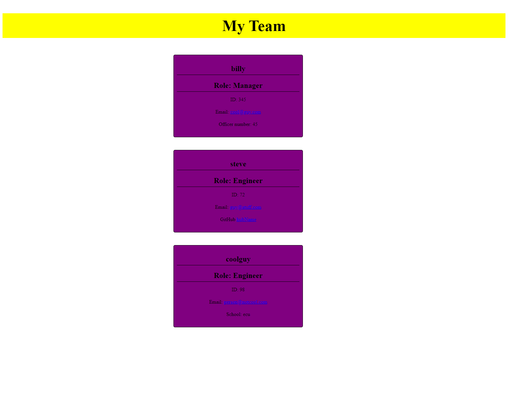

# team-profile-generator

## Table of Contents
1. [Description](#description)
2. [Visuals](#visuals)
3. [Resources](#resources)

## Description

This assignmant required the user use a generagte page to make a html file that was created based on the resposes of the person running the code.

## Visuals

## Resources
- [Live Site](https://mortalmx13.github.io/team-profile-generator/)

- [Respository](https://github.com/Mortalmx13/team-profile-generator)